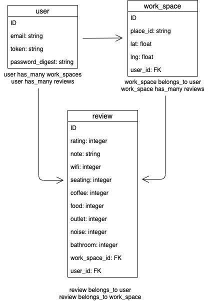

# Work From Roam API


[Deployed API](https://warm-chamber-62945.herokuapp.com/)

[Deployed Client](https://sei-uxdi-collab.github.io/work_from_roam-client/)

[Client Repo](https://github.com/sei-uxdi-collab/work_from_roam-client)

## ERD



## Dependencies

Install with `bundle install`.

-   [`rails-api`](https://github.com/rails-api/rails-api)
-   [`rails`](https://github.com/rails/rails)
-   [`active_model_serializers`](https://github.com/rails-api/active_model_serializers)
-   [`ruby`](https://www.ruby-lang.org/en/)
-   [`postgres`](http://www.postgresql.org)


### Setup your database:
    - bin/rails db:drop (if it already exists)
    - bin/rails db:create
    - bin/rails db:migrate
    - bin/rails db:seed
    - bin/rails db:examples

  **Note**: Do this for each database you want to set up. Your local database and production (Heroku) database will both need to be set up in this way!


### Run your server!
1. Run the API server with `bin/rails server` or `bundle exec rails server`.

### Endpoints and Curl Scripts

| Verb   | URI Pattern            | Controller#Action |
|--------|------------------------|-------------------|
| POST   | `/work_spaces`             | `work_spaces#create`    |
| POST   | `/reviews`             | `reviews#create`    |
| GET  | `/work_spaces`     | `work_spaces#index`  |
| GET | `/reviews`        | `reviews#index`   |
| GET | `/work_spaces/:id` | `workspaces#show` |
| GET | `/reviews/:id` | `reviews#show` |

### POST/Create a work_space
```sh
curl "http://localhost:4741/work_spaces" \
  --include \
  --request POST \
  --header "Content-Type: application/json" \
  --header "Authorization: Token token=${TOKEN}" \
  --data '{
    "work_space": {
      "place_id": "'"${PLACE}"'",
      "lat": "'"${LAT}"'",
      "lng": "'"${LNG}"'"
    }
  }'
```

### GET/Show a work_space
```sh
curl "http://localhost:4741/work_spaces/${ID}" \
  --include \
  --request GET \
  --header "Content-Type: application/json" \
  --header "Authorization: Token token=${TOKEN}" \

```

### POST/Create a review
```sh
curl "http://localhost:4741/reviews" \
  --include \
  --request POST \
  --header "Content-Type: application/json" \
  --header "Authorization: Token token=${TOKEN}" \
  --data '{
    "review": {
      "rating": "'"${RATING}"'",
      "note": "'"${NOTE}"'",
      "wifi": "'"${WIFI}"'",
      "food": "'"${FOOD}"'",
      "bathroom": "'"${BATH}"'",
      "coffee": "'"${COFFEE}"'",
      "seating": "'"${SEAT}"'",
      "outlet": "'"${OUT}"'",
      "noise": "'"${NOISE}"'",
      "review": "'"${REV}"'",
      "work_space_id": "'"${ID}"'"
    }
  }'
```

### GET/Show a review
```sh
curl "http://localhost:4741/reviews/${ID}" \
  --include \
  --request GET \
  --header "Content-Type: application/json" \
  --header "Authorization: Token token=${TOKEN}" \
```

## API


### Authentication Endpoints and Curl Scripts

| Verb   | URI Pattern            | Controller#Action |
|--------|------------------------|-------------------|
| POST   | `/sign-up`             | `users#signup`    |
| POST   | `/sign-in`             | `users#signin`    |
| PATCH  | `/change-password`     | `users#changepw`  |
| DELETE | `/sign-out`        | `users#signout`   |

#### POST /sign-up

Request:

```sh
curl http://localhost:4741/sign-up \
  --include \
  --request POST \
  --header "Content-Type: application/json" \
  --data '{
    "credentials": {
      "email": "'"${EMAIL}"'",
      "password": "'"${PASSWORD}"'",
      "password_confirmation": "'"${PASSWORD}"'"
    }
  }'
```

```sh
EMAIL=ava@bob.com PASSWORD=hannah curl-scripts/auth/sign-up.sh
```

Response:

```md
HTTP/1.1 201 Created
Content-Type: application/json; charset=utf-8

{
  "user": {
    "id": 1,
    "email": "ava@bob.com"
  }
}
```

#### POST /sign-in

Request:

```sh
curl http://localhost:4741/sign-in \
  --include \
  --request POST \
  --header "Content-Type: application/json" \
  --data '{
    "credentials": {
      "email": "'"${EMAIL}"'",
      "password": "'"${PASSWORD}"'"
    }
  }'
```

```sh
EMAIL=ava@bob.com PASSWORD=hannah curl-scripts/auth/sign-in.sh
```

Response:

```md
HTTP/1.1 200 OK
Content-Type: application/json; charset=utf-8

{
  "user": {
    "id": 1,
    "email": "ava@bob.com",
    "token": "BAhJIiVlZDIwZTMzMzQzODg5NTBmYjZlNjRlZDZlNzYxYzU2ZAY6BkVG--7e7f77f974edcf5e4887b56918f34cd9fe293b9f"
  }
}
```

#### PATCH /change-password

Request:

```sh
curl --include --request PATCH "http://localhost:4741/change-password" \
  --header "Authorization: Token token=$TOKEN" \
  --header "Content-Type: application/json" \
  --data '{
    "passwords": {
      "old": "'"${OLDPW}"'",
      "new": "'"${NEWPW}"'"
    }
  }'
```

```sh
OLDPW='hannah' NEWPW='elle' TOKEN='BAhJIiVlZDIwZTMzMzQzODg5NTBmYjZlNjRlZDZlNzYxYzU2ZAY6BkVG--7e7f77f974edcf5e4887b56918f34cd9fe293b9f' sh curl-scripts/auth/change-password.sh
```

Response:

```md
HTTP/1.1 204 No Content
```

#### DELETE /sign-out

Request:

```sh
curl http://localhost:4741/sign-out \
  --include \
  --request DELETE \
  --header "Authorization: Token token=$TOKEN"
```

```sh
TOKEN='BAhJIiVlZDIwZTMzMzQzODg5NTBmYjZlNjRlZDZlNzYxYzU2ZAY6BkVG--7e7f77f974edcf5e4887b56918f34cd9fe293b9f' sh curl-scripts/auth/sign-out.sh
```

Response:

```md
HTTP/1.1 204 No Content
```

## Additional Resources
- [rails-heroku-setup-guide](https://git.generalassemb.ly/ga-wdi-boston/rails-heroku-setup-guide)
- [Rails Guides: API-only app](http://guides.rubyonrails.org/api_app.html)
- [Building a JSON API with Rails 5](https://blog.codeship.com/building-a-json-api-with-rails-5/)

## [License](LICENSE)

1.  All content is licensed under a CC­BY­NC­SA 4.0 license.
1.  All software code is licensed under GNU GPLv3. For commercial use or
    alternative licensing, please contact legal@ga.co.
